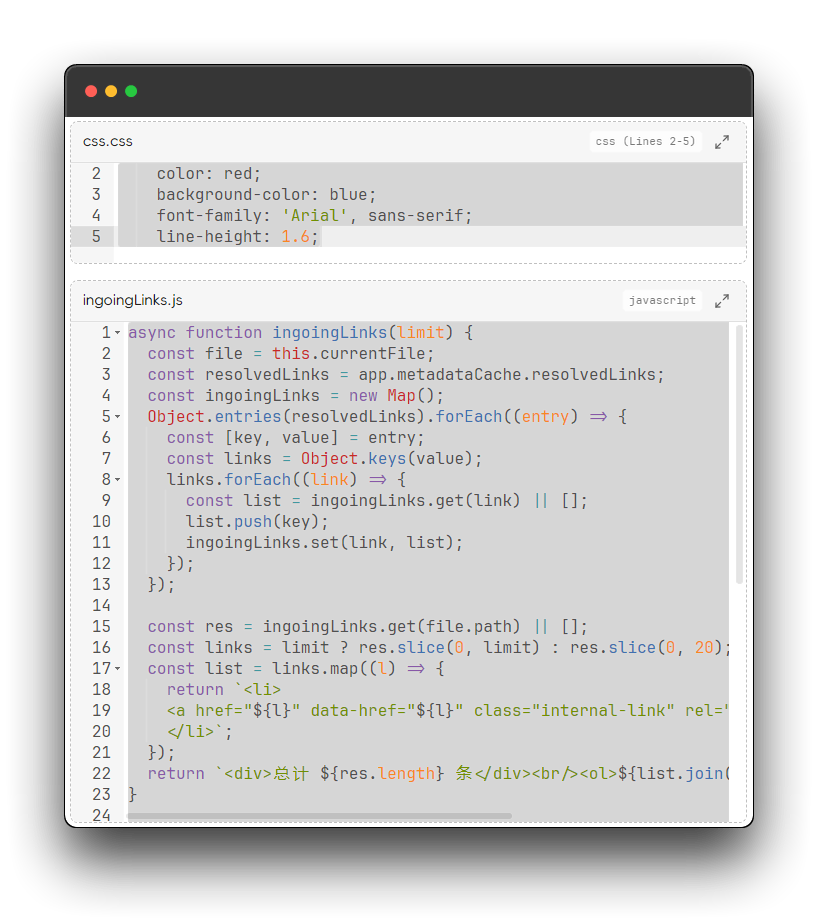

# Embedding Code Files in Markdown

In Obsidian, you can use wiki double-link syntax (`![[]]`) to embed other files. Based on this feature, we can render code file content in markdown files.

## Prerequisites

- In Obsidian settings, `Files & Links -> Use [[Wikilinks]]` must be enabled
- In plugin settings `Sessions -> Register File Types`, the file type you want to embed must be registered

## File Reference with Line Range

Use `![[file#L1]]` to render only the code content of line 1

Use `![[file#L1-L20]]` to render code content from lines 1-20

## Navigate to Code File

Click the icon in the top-right corner of the embed block to open the code file in a new tab

## Height of Embedded View

Change the value in plugin settings `Extensions -> Max Height of Embedded Code Block`

The unit is `px`. After changing, you need to reopen the `markdown` file for it to be properly rendered in reading mode.
