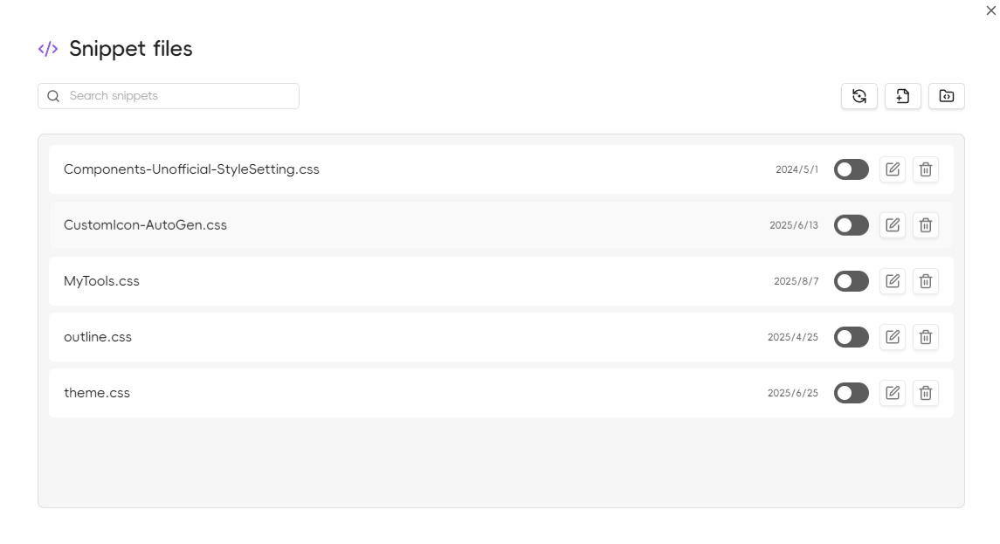

# CSS Snippets Management

## Feature Overview

The Ace Code Editor plugin provides convenient CSS snippets management functionality, allowing you to create, edit, and manage custom styles directly within Obsidian.

## Accessing the Snippets Manager

The plugin adds a management entry icon to the leftmost ribbon by default, with the default icon being <LucideIcon name="Code" class="inline-icon"/>



### Opening Methods

1. **Ribbon Icon**: Click the code icon in the left ribbon
2. **Command Palette**: Use `Ctrl/Cmd + P` to open the command palette, search for "CSS Snippets Manager"
3. **Hotkey**: Can be customized in settings

## Main Features

### Creating New CSS Snippets

1. Click the "New Snippet" button in the manager
2. Enter the snippet name
3. Write CSS code in the editor
4. Save the snippet

### Editing Existing Snippets

1. Select the snippet to edit from the snippet list
2. Click the edit button
3. Modify the code in the Ace editor
4. Save changes

### Enable/Disable Snippets

- Use the toggle button next to snippets to quickly enable or disable them
- Disabled snippets will not be applied to the Obsidian interface

### Deleting Snippets

1. Select the snippet to delete
2. Click the delete button
3. Confirm the deletion

## Editor Features

### CSS Syntax Support

- **Syntax Highlighting**: Complete CSS syntax highlighting
- **Code Completion**: Intelligent completion for CSS properties and values

### Live Preview

- Style changes are applied immediately after saving
- No need to restart Obsidian
- Supports hot reload

## Best Practices

### Snippet Naming

- Use descriptive names like "dark-theme-enhancement" or "custom-callouts"
- Avoid special characters and spaces
- Recommend using lowercase letters and hyphens

### Code Organization

```css
/* Add comments to explain snippets */
/* Custom callout styles */

.callout[data-callout="custom"] {
    --callout-color: 68, 138, 255;
    --callout-icon: lucide-star;
}

/* Custom font settings */
.markdown-preview-view {
    font-family: "JetBrains Mono", monospace;
}
```

### Performance Optimization

- Avoid overly complex selectors
- Use CSS variables appropriately
- Regularly clean up unused snippets

## Troubleshooting

### Common Issues

**Snippet Not Working**
- Check if the snippet is enabled
- Confirm CSS syntax is correct
- Verify selectors match target elements

**Editor Won't Open**
- Restart Obsidian
- Check if the plugin is properly enabled
- Open Developer Tools with `Ctrl+Shift+I` (or `Cmd+Option+I` on Mac), then check the Console tab for error messages

**Style Conflicts**
- Use more specific selectors
- Add `!important` declarations (use cautiously)
- Adjust snippet loading order