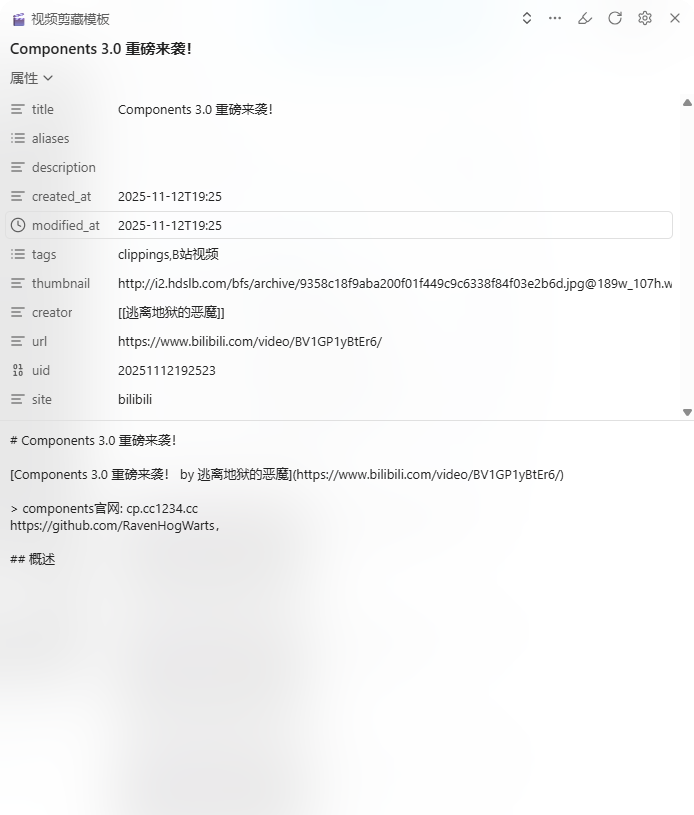

::: info
作者：Moy

主页：https://github.com/Moyf

适用网站：[bilibili](https://www.bilibili.com)视频
:::

::: details json 代码
```json
{
	"schemaVersion": "0.1.0",
	"name": "🎬 视频剪藏模板",
	"behavior": "create",
	"noteContentFormat": "# {{title|replace:(\"#\":\"＃\",\"`\":\"\", \"|\": \"-\")|replace:(\"_哔哩哔哩_bilibili\":\"\",\"_游戏热门视频\":\"\")}}\n\n[{{title|replace:(\"#\":\"＃\",\"`\":\"\", \"|\": \"-\")|replace:(\"_哔哩哔哩_bilibili\":\"\")}} by {{author}}]({{url|replace:\"/\\?vd_.*/g\":\"\"}})\n\n> {{description|replace:(\"/相关视频：.*/g\":\"\", \"/视频作者.*/g\":\"\", \"/, 视频播放量.*/g\":\"\" )}}\n\n## 概述\n\n",
	"properties": [
		{
			"name": "title",
			"value": "{{title|replace:(\\\"#\\\":\\\"＃\\\",\\\"`\\\":\\\"\\\", \\\"|\\\": \\\"-\\\")|replace:(\\\"_哔哩哔哩_bilibili\\\":\\\"\\\",\\\"_游戏热门视频\\\":\\\"\\\")}}",
			"type": "text"
		},
		{
			"name": "aliases",
			"value": "",
			"type": "text"
		},
		{
			"name": "description",
			"value": "",
			"type": "text"
		},
		{
			"name": "created_at",
			"value": "{{time|date:YYYY-MM-DD[T]HH:mm}}",
			"type": "text"
		},
		{
			"name": "modified_at",
			"value": "{{time|date:YYYY-MM-DD[T]HH:mm}}",
			"type": "datetime"
		},
		{
			"name": "tags",
			"value": "clippings,B站视频",
			"type": "multitext"
		},
		{
			"name": "thumbnail",
			"value": "{{schema:@VideoObject:thumbnailUrl|first}}",
			"type": "text"
		},
		{
			"name": "creator",
			"value": "{{author|wikilink}}",
			"type": "text"
		},
		{
			"name": "url",
			"value": "{{url|replace:\\\"/\\?vd_.*/g\\\":\\\"\\\"}}",
			"type": "text"
		},
		{
			"name": "uid",
			"value": "{{time|date:\\\"YYYYMMDDHHmmss\\\"}}",
			"type": "number"
		},
		{
			"name": "site",
			"value": "{{domain|replace:(\\\".com\\\":\\\"\\\")}}",
			"type": "text"
		}
	],
	"triggers": [
		"https://www.bilibili.com/video/"
	],
	"noteNameFormat": "{{title|replace:(\"#\":\"＃\",\"`\":\"\", \"|\": \"-\")|replace:(\"_哔哩哔哩_bilibili\":\"\",\"_游戏热门视频\":\"\")}}",
	"path": "网络摘录/Clippings/{{date|date:YYYY-MM}}"
}
```
:::



