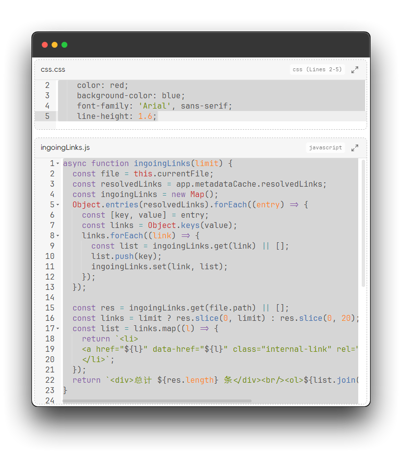

# 在 markdown 文件中嵌入代码文件

在 Obsidian 中可以使用 wiki 双链语法（`![[]]`）来嵌入其他文件，依据这一特性我们可以在 markdown 文件中渲染出代码文件内容

## 使用前提

- Obsidian 设置中 `文件与链接 -> 使用 Wiki 链接` 功能需开启
- 在插件设置 `会话 -> 注册文件类型` 中必须有需要嵌入的代码文件的类型

## 带行号范围的文件引用

使用 `![[file#L1]]` 只渲染出第 1 行的代码内容

使用 `![[file#L1-L20]]` 渲染出第 1-20 行的代码内容

## 跳转代码文件

点击嵌入框的右上角图标可以在新标签页打开代码文件

## 嵌入视图的高度

在插件设置 `扩展 -> 嵌入代码块最大高度` 中更改数值

单位为 `px` ，更改后需要重新打开 `markdown` 文件才能正确被阅读模式渲染出来
