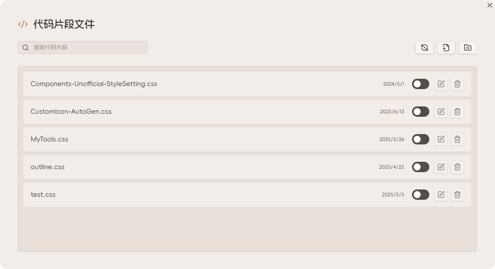

# CSS 代码片段管理

## 功能概述

Ace Code Editor 插件提供了便捷的 CSS 代码片段管理功能，让你可以直接在 Obsidian 中创建、编辑和管理自定义样式。

## 访问代码片段管理器

插件默认在最左侧的功能区添加了管理入口图标，默认图标为 <LucideIcon name="Code" class="inline-icon"/>



### 打开方式

1. **侧边栏图标**：点击左侧功能区的代码图标
2. **命令面板**：使用 `Ctrl/Cmd + P` 打开命令面板，搜索 "CSS 代码片段管理器"
3. **快捷键**：可在设置中自定义快捷键

## 主要功能

### 创建新的 CSS 片段

1. 点击管理器中的 "新建片段" 按钮
2. 输入片段名称
3. 在编辑器中编写 CSS 代码
4. 保存片段

### 编辑现有片段

1. 在片段列表中选择要编辑的片段
2. 点击编辑按钮
3. 在 Ace 编辑器中修改代码
4. 保存更改

### 启用/禁用片段

- 使用片段旁边的开关按钮快速启用或禁用片段
- 禁用的片段不会应用到 Obsidian 界面

### 删除片段

1. 选择要删除的片段
2. 点击删除按钮
3. 确认删除操作

## 编辑器特性

### CSS 语法支持

- **语法高亮**：完整的 CSS 语法高亮
- **代码补全**：CSS 属性和值的智能补全

### 实时预览

- 保存后立即应用样式更改
- 无需重启 Obsidian
- 支持热重载

## 最佳实践

### 片段命名

- 使用描述性的名称，如 "dark-theme-enhancement" 或 "custom-callouts"
- 避免使用特殊字符和空格
- 建议使用小写字母和连字符

### 代码组织

```css
/* 为片段添加注释说明 */
/* 自定义标注样式 */

.callout[data-callout="custom"] {
    --callout-color: 68, 138, 255;
    --callout-icon: lucide-star;
}

/* 自定义字体设置 */
.markdown-preview-view {
    font-family: "JetBrains Mono", monospace;
}
```

### 性能优化

- 避免过于复杂的选择器
- 合理使用 CSS 变量
- 定期清理不使用的片段

## 故障排除

### 常见问题

**片段不生效**
- 检查片段是否已启用
- 确认 CSS 语法正确
- 检查选择器是否匹配目标元素

**编辑器无法打开**
- 重启 Obsidian
- 检查插件是否正常启用
- 查看控制台错误信息

**样式冲突**
- 使用更具体的选择器
- 添加 `!important` 声明（谨慎使用）
- 调整片段加载顺序