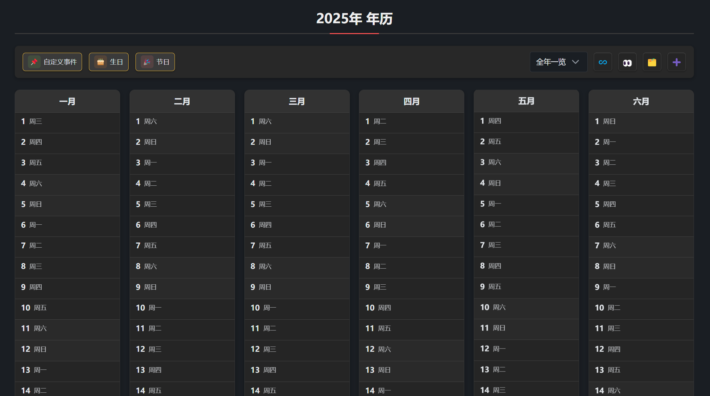
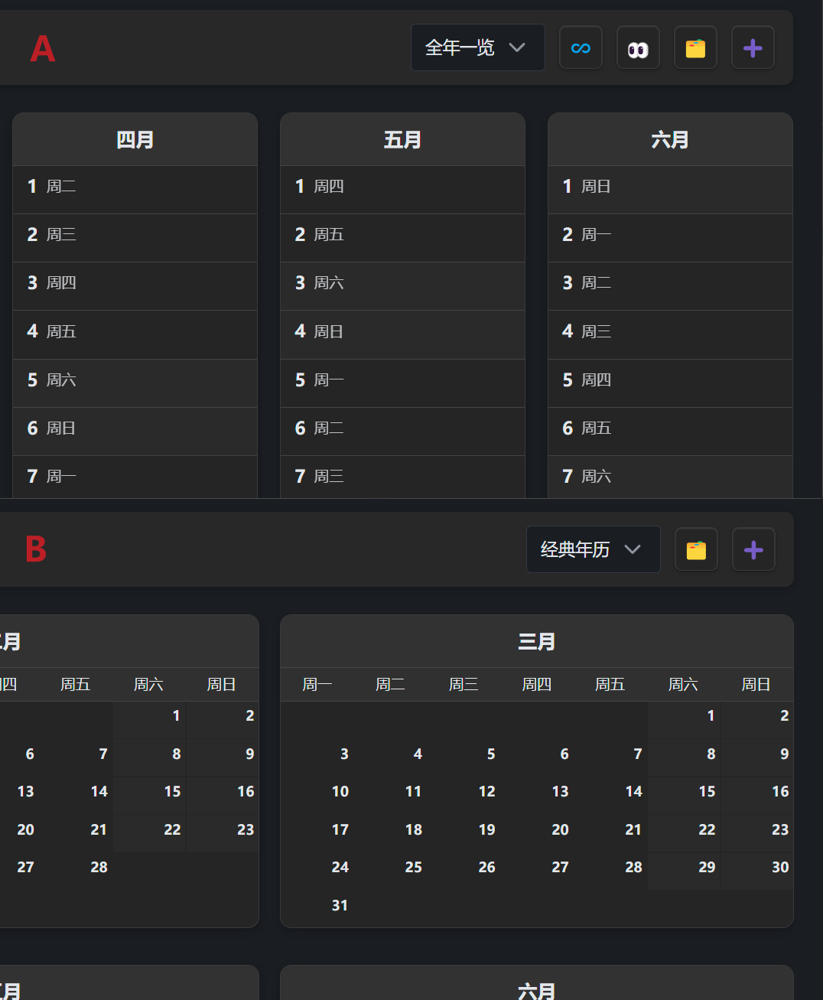

# 视图

Yearly Glance 提供多种视图，帮助你高效浏览和管理全年事件。

## 基础视图

- 年历视图：以列表方式展示全年所有月份和日期，适合年度规划。
- 经典日历视图：以传统日历表格方式展示，便于查阅每月详情。

## 工具栏

- 左侧为事件类型筛选按钮，可快速切换显示节假日、生日、自定义事件。
- 右侧为布局切换按钮，可在不同视图间切换。
- 下拉菜单可切换不同年份。

## 交互说明

- 点击日期可添加事件。
- 点击事件可查看、编辑或删除。
- 鼠标悬停可显示事件详情。

> 事件类型和管理详见“[事件管理](/obsidian-yearly-glance/guide/event)”章节。

## 视图切换

- 支持全屏、紧凑等多种布局，适应不同使用场景。
- 可自定义显示内容和样式。
- 不同视图下，事件显示方式和交互略有差异。

