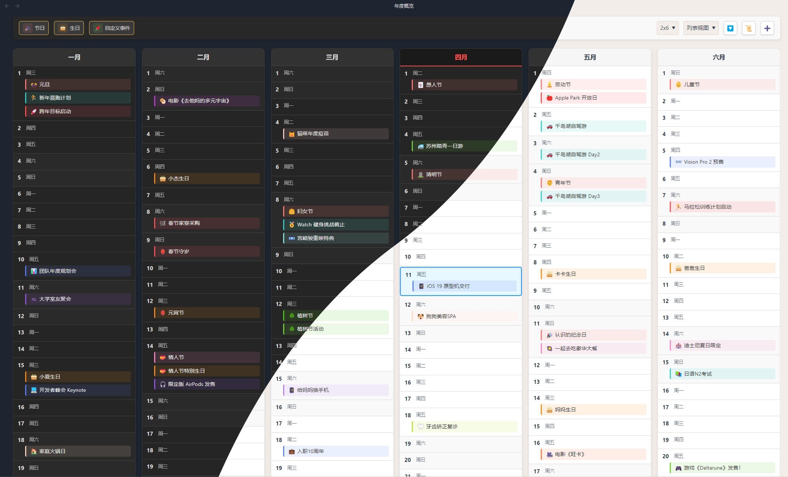

# Yearly Glance

::: info 简介
Obsidian 插件，提供可视化且可自定义的年度事件概览，帮助您高效规划、回顾和管理全年重要日期。

- 项目地址：[Yearly Glance](https://github.com/Moyf/yearly-glance)

- Obsidian 商店安装: [Yearly Glance](https://obsidian.md/plugins?id=yearly-glance)
:::

从这里开始，您将获得一眼纵览全年的能力！

## 主要亮点

- **📅 年历视图** - 一览全年所有月份和日期，使年度规划变得轻松自如
- **🎉 多种事件类型** - 支持节假日、生日和完全可自定义的事件
- **🎂 生日管理** - 跟踪生日并显示年龄、星座等属性信息
- **🎨 高度可定制** - 提供多种布局和样式，可以用颜色和 Emoji 让事件生动多彩
- **🖱️ 交互界面** - 点击任意事件即可查看详情或快速编辑
- **🎯 事件筛选** - 按事件类型筛选，获得更清晰的视图
- **🌙 农历支持** - 原生支持中国传统农历
- **🌐 多语言支持** - 提供英文和中文（简繁）界面

## 创作团队

<VPTeamMembers size="small" :members="members" />